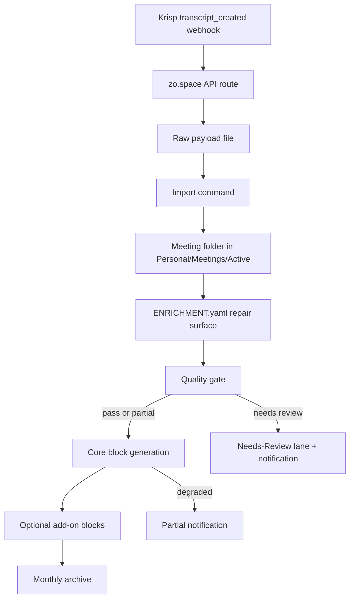

# Portable Krisp Meeting Blocks Spec

## Boundary

This skill packages only the portable layer of a Krisp meeting pipeline:

- receive Krisp transcript events
- persist raw payloads
- normalize into meeting folders
- create a manual repair surface
- generate block markdown files
- archive by month
- notify the local Zo owner when automation cannot fully trust the output

It intentionally excludes:

- V-specific CRM enrichment
- V-specific calendar triangulation
- Fathom, Drive, Pocket, Sentience, and Fireflies intake
- research repo extraction
- private HITL queues under `N5/`
- V's personal notification addresses/handles

## Pipeline



## Meeting State Values

| Status | Meaning |
|---|---|
| `imported` | Payload normalized into a meeting folder. |
| `needs_review` | Cannot safely process without human input. |
| `processing` | Block generation currently running. |
| `partial` | Core output exists but quality/block completion is degraded. |
| `processed` | Blocks generated and ready for archive. |
| `archived` | Folder moved to monthly archive. |
| `rejected` | Input did not meet minimum transcript requirements. |

## Manifest Essentials

```json
{
  "manifest_version": "1.0",
  "meeting_id": "2026-06-23-product-call",
  "title": "Product Call",
  "status": "archived",
  "source": {
    "type": "krisp",
    "event_type": "transcript_created",
    "source_id": "krisp-meeting-id",
    "payload_path": "Personal/Integrations/krisp-meeting-blocks/processed/...json"
  },
  "meeting": {
    "date": "2026-06-23",
    "duration_seconds": 1800,
    "participants": []
  },
  "quality": {
    "state": "ok|partial|needs_review|rejected",
    "reasons": []
  },
  "block_completion": {
    "core": ["summary", "metadata", "decisions", "action_items"],
    "generated": [],
    "failed": [],
    "degraded": false
  },
  "archive": {
    "strategy": "monthly",
    "path": "Personal/Meetings/2026/06-June/..."
  }
}
```

## Notification Event Shape

```json
{
  "event_type": "meeting_partial|meeting_needs_review",
  "meeting_id": "2026-06-23-product-call",
  "title": "Product Call",
  "meeting_path": "Personal/Meetings/Active/...",
  "severity": "warning|review",
  "reasons": ["generic_speakers_without_participant_context"],
  "created_at": "2026-06-23T12:00:00Z"
}
```
